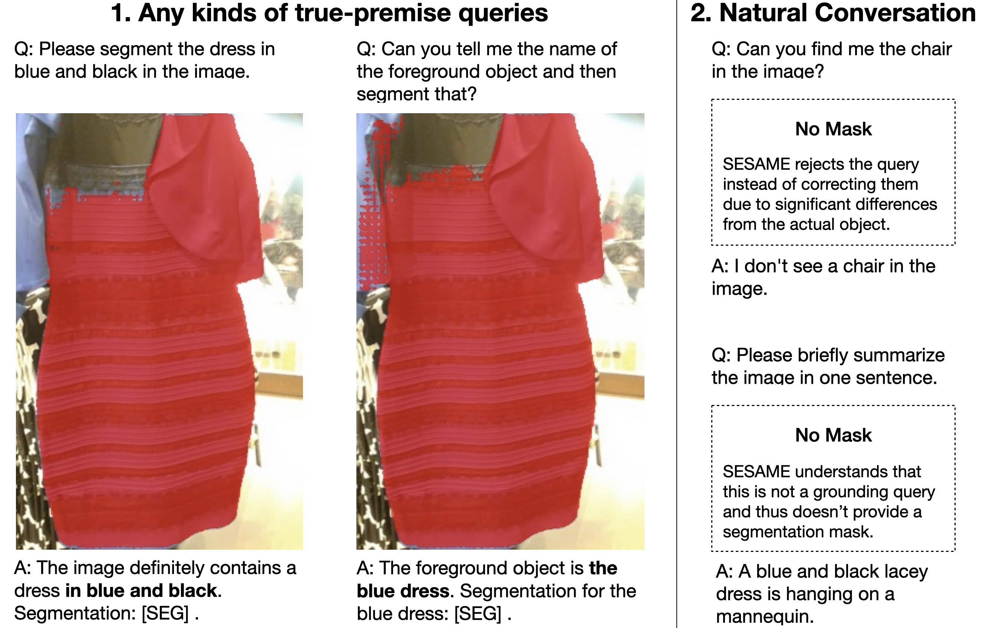

# SESAME: A holistic LMM that can See, Say, and Segment

[](https://lbesson.mit-license.org/)  [](https://arxiv.org/abs/2312.08366) 

This repo provides the PyTorch source code of our paper: [See, Say, and Segment: Teaching LMMs to Overcome False Premises (CVPR 2024)](https://arxiv.org/abs/2312.08366). Check out project page [here](https://see-say-segment.github.io/)!

**Authors**: [Tsung-Han Wu\*](https://tsunghan-wu.github.io/), [Giscard Biamby\*](https://scholar.google.com/citations?user=s0Fof5IAAAAJ&hl=en), [David M. Chan](https://dchan.cc/), [Lisa Dunlap](https://www.lisabdunlap.com/), [Ritwik Gupta](https://ritwikgupta.me/), [Xudong Wang](https://people.eecs.berkeley.edu/~xdwang/), [Joseph E. Gonzalez](https://people.eecs.berkeley.edu/~jegonzal/), [Trevor Darrell†](https://people.eecs.berkeley.edu/~trevor/) at UC Berkeley. 

## :rocket: One-Minute Introduction

### The Importance of a Holistic LMM

Nowadays, it's increasingly crucial for multimodal models to interact with humans in natural, intuitive ways—primarily through natural language, and image grounding (segmentation) models are no exception. Considering the famous "[The Dress Illusion](https://en.wikipedia.org/wiki/The_dress)" from 2015, when a model is asked to identify an object that doesn't exist within an image, it should ideally reject the query politely and perhaps suggest an alternative. As shown in the following image, existing LMM-based segmentation models often struggle under this setting while our SESAME model can gracefully handle it.


<details>

<summary>Explore more complex examples of our SESAME model!</summary>



Beyond adeptly managing false-premise queries, an ideal multimodal intelligent system must tackle a variety of tasks, from image captioning and visual question answering to precise grounding tasks. Inspired by this vision, we propose SESAME, a comprehensive LMM capable of handling diverse multimodal interactions.

</details>

### The Problem Setting of SESAME (SEe, SAy, segMEnt)

We introduce a Novel Problem Setting, requiring LMMs that can See, Say and Segment. Specifically, we require these models to

1. **See** by detecting if an object from the query is present in an image,
2. **Say** something about the object itself if it’s not there and suggest alternatives to the user’s query,
3. **Segment** by showing where in an image an existent object is grounded.


To support this new setting, we propose a new benchmark dataset and have developed a new model. Let’s dive in and explore SESAME together!

## :rotating_light: Status Update
- **06/16/2024:** Uploaded training/evaluation/single-image-demo scripts, along with checkpoints and datasets for referring segmentation.

## :wrench: Installation Guide

### System Requirements

- System Setup: Linux with one or more Nvidia A100 GPUs (Ampere GPUs required due to flash-attn usage during training). Minor adjustments may be necessary for Mac or Windows.
- Dependency Installation: Create a Python environment named "sesame" and install necessary dependencies:

```bash=
conda create -n sesame python=3.9
pip3 install pybind11==2.11.1
pip3 install -r requirements.txt 
pip install flash-attn --no-build-isolation
```

## :crystal_ball: Model and Dataset Release

Links to [FP-RefCOCO* Datasets](https://drive.google.com/file/d/1mA3kcY3QiAZz1Zr89MCKYd7e3LBIwUzl/view?usp=sharing), and [Huggingface Model Collections](https://huggingface.co/collections/tsunghanwu/sesame-666c9b43efff2acaafc61882) are available. Visit our [Dataset page](./dataset/README.md) for more details.

Currently, we release two models are specifically trained for referring segmentation tasks. Below are key notes and the cIoU score of these models.

| Model Name | LMM | HG-ckpt URL | FP-RefCOCO | FP-RefCOCO+  | FP-RefCOCOg | RefCOCO | RefCOCO+ | RefCOCOg | 
|------------|----------------|----------------|----|----|----| ----|----|----|
| SESAME-    | LLaVA-v1.5-7B  | [tsunghanwu/SESAME_minus](https://huggingface.co/tsunghanwu/SESAME_minus) | 43.78 | 39.50 | 39.35 | 76.00 | 67.24 | 68.48 | 
| SESAME     | LLaVA-v1.5-7B  | [tsunghanwu/SESAME](https://huggingface.co/tsunghanwu/SESAME) |   59.80 |  53.32 | 54.98 | 74.94 | 66.54 | 67.95 |

**Notes**
1. All performance numbers are evaluated using the validation split.
2. The SESAME- model is exclusively trained with RefCOCO* data.
3. The SESAME model is trained with multiple datasets: LLaVA VQA, RefCOCO*, R-RefCOCO*, and our proposed FP-RefCOCO* data.
4. The numbers presented here may be slightly higher than those reported in our paper, as the models were not fully fine-tuned before submission. Feel free to cite either the numbers from this page or the lower numbers from our paper, as both are accurate.

</details>

## :gear: Usage

Run the following command to enjoy the interaction with our SESAME model:

```
CUDA_VISIBLE_DEVICES=X python demo.py
```

You can easily reproduce the result on the "The Dress" example using the image in `assets/The_dress.jpg` and the exact same prompt showing on the above image.

## :chart_with_upwards_trend: Evaluation

Please follow the [dataset instruction](./dataset/README.md) to at least setup RefCOCO(+/g) and FP-RefCOCO(+/g). Then, to evaluate the model on our See-Say-Segment benchmark datasets, run:

```python
bash eval_sesame.sh
```

**Note**
1. Running the full inference for an auto-regressive LMM can be a bit slow as (FP-)RefCOCO(+/g) contains more than 100k queries in total. We recommend using multiple GPUs in parallel (less than 2 hours with 8 GPUs on a single dataset). Please reach out to me or create a PR is you figure out ways to speedup!
2. The above code only evaluate SEE and Segment Score. For the Say evaluation, we're currently facing version conflicts across different packages and plan to realease them in the near future.

## :fire: Training 

Please follow the [dataset instruction](./dataset/README.md) to first setup all dataset needed. Then, initiate training using:

```bash=
bash train_sesame.sh [ReferSeg or ReasonSeg] [Deepspeed GPU Settings] [MASTERPORT]
# Example:
train_sesame.sh ReferSeg localhost:0,1 15990
```

**Training Details and Tricks**
- Instead of sampling more positive samples in our FP-RefCOCO dataset, in the implementation we actually adding the original RefCOCO positive examples into the data pool and assign the sampling weight. It is worth noting that the sampling ratio between pure VQA qureies and those requiring segmentation outputs can be sensitive. Be careful when you modify this parameter.
- It should be okay to train a model with lower GPU memory footprint. When reducing the number of GPUs and the batch size, please increase the gradient accumulation steps such that `batch_size * num_gpus * grad_accumulation_steps` is rounghly 100. (In the script the value is 12 * 8 * 1).
- Training with the whole RefCOCO dataset series can be tricky because some of the test images in refcoco(+) apprears in refcocog and vice versa. To prevent data contamination, we have preprocess a pickle file to exclude all overlapping samples during training. See more details in the [dataset page](./dataset/README.md).
- For the rest of the configs such as paths, experiment names, and wandb setting, please modify them in the shell script if needed.


After the training, the lora finetuned weight of LMM (llava) as well as the segmentation decoder will be saved as a deepspeed zero fp32 format. To save the model into a torch loadable model, please run the following script:

```
bash merge_lora_weight.sh
```

You may modify the parameters if needed.

## :pray: Acknowledgements

We are grateful for the foundational code provided by [LISA](https://github.com/dvlab-research/LISA), [LLaVA](https://github.com/haotian-liu/LLaVA), and [SAM](https://github.com/facebookresearch/segment-anything). Utilizing their resources implies agreement to their respective licenses. Our project benefits greatly from these contributions, and we acknowledge their significant impact on our work. We also want to credit the photo sources of [The Dress](https://web.archive.org/web/20150227014959/http://swiked.tumblr.com/post/112073818575/guys-please-help-me-is-this-dress-white-and).

## :dart: Citation

If you use our work or our implementation in this repo, or find them helpful, please consider giving a citation.
```
@inproceedings{wu2024see,
  title={See Say and Segment: Teaching LMMs to Overcome False Premises},
  author={Wu, Tsung-Han and Biamby, Giscard and Chan, David and Dunlap, Lisa and Gupta, Ritwik and Wang, Xudong and Gonzalez, Joseph E and Darrell, Trevor},
  booktitle={Proceedings of the IEEE/CVF Conference on Computer Vision and Pattern Recognition},
  pages={13459--13469},
  year={2024}
}
```
